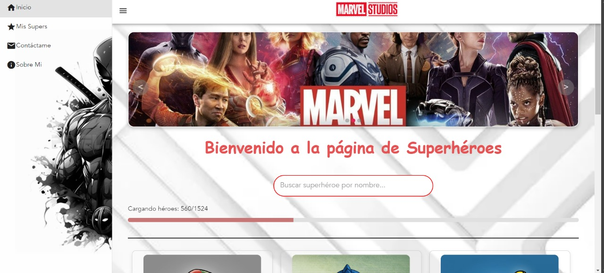

# Prueba Tecnica Uteam (FrontEnd)

* 💬 Pagina trabajada con Java script y vue, es una prueba tecnica que cumple con las consignas y trabaja con la api de marvel
* 🛠️ Intuitiva y de facil recorrido 
* 📁 Utiliza el metodo CRUD para (Created, Read, Update, Delete)
* 🪟 Realizada con Node.js, Vue, Pina, axios, y estilada con css puro


  

* Consignas:
 A - PRUEBA TÉCNICA FRONTEND VUEJS

Se requiere desarrollar una pequeña web con el framework de VUEJS

Se requiere:

1.    Generar una interfaz de usuario donde exista a lo menos 3 componentes anidados entre sí.

2.    Los componentes creados deben hacer uso de los binding necesarios para el traspaso de información y acciones para su interacción.

3.    Cada componente debe tener su Lifecycle (ciclo de vida) necesario.

4.    La información desplegada debe venir desde api Rest (https://developer.marvel.com/)

5.    Con la información desplegada desde el Api Rest, hacer un CRUD funcional

 


## 🌟 Quick Start

1. 👤 Recorda que cualquier duda o consulta podes comunicarte con migo en linkedin No te olvides de seguirme :D

<a href="https://www.linkedin.com/in/andres-vera-676414281/" target="_blank">


</a> 


2. ⬇️ Clona el repositorio

    ```bash
    $ git clone https://github.com/AndresXX1/Uteam-Front-Vue
    ```

3. 📦 Instala dependencias

    ```bash
    $ npm install
    ```


4. 🏃‍️ Inicia la aplicacion!

    ```bash
    $ npm run serve

    ```


## 🌐 Aplicaccion desplegada

https://uteam-front-vue.vercel.app/